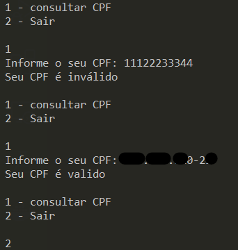

#  DesafioRubyDIO

The objective of the challenge was to create a program in the Ruby language that would check whether the CPF entered by the user is valid or invalid.

## Didactics:
You need to create a query program for the user's CPF. your code
need to use a special library to know if the
numbers that the user typed are from a real CPF.

## Usage example


## Instalation
```bash
bundle install
```
Or if you prefer to do the installation manually:
```bash
gem install cpf_cnpj
```

## Important Links
[Challenge link](https://academiapme-my.sharepoint.com/:p:/g/personal/kawan_dio_me/EWACd6TsvwFCgHrDlvrDMYUB7VZqEVLrm_PrdorMMpIjGg?e=zWBCSe)
